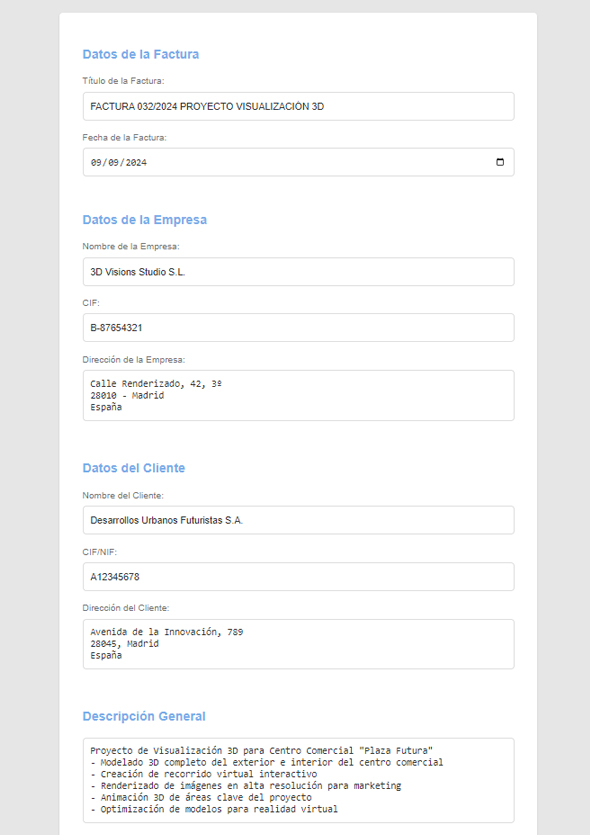
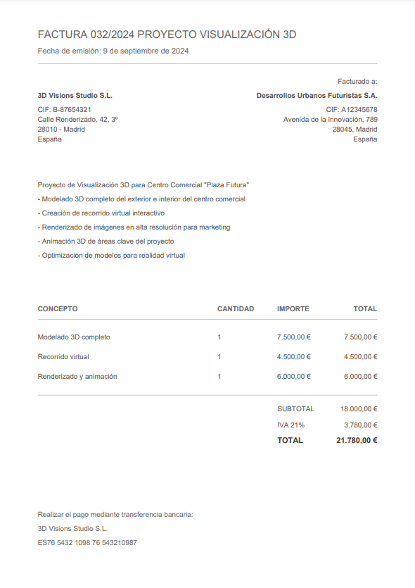

# Invoicer WebAPP

Mini Aplicación Web sencilla para crear facturas rápidas y elegantes.
Programada usando Cursor y ChatGPT.

## Características

- Generación simple de facturas en PDF
- Diseño minimalista y elegante
- No requiere instalación ni servidor
- No almacena ningún tipo de dato

## Tecnologías

- HTML
- CSS
- JavaScript
- jsPDF

## Uso

1. Abre `index.html` en tu navegador
2. Completa los datos de la factura
3. Haz clic en "Generar Factura (PDF)"

## Demo

Si lo deseas, puedes probar la aplicación con el formulario de ejemplo abriendo `test.html`

## Licencia

Este proyecto es de dominio público. Puedes copiar, modificar, distribuir y realizar el trabajo, incluso para fines comerciales, sin pedir permiso.

## Imágenes de demostración

  
  

